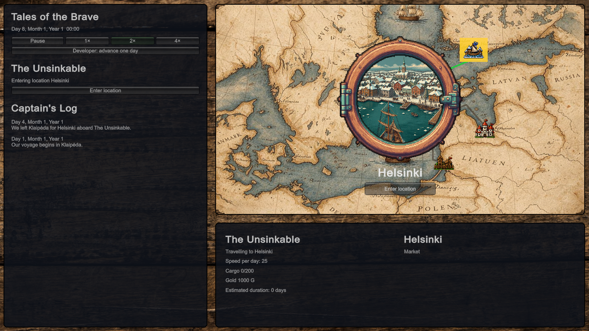
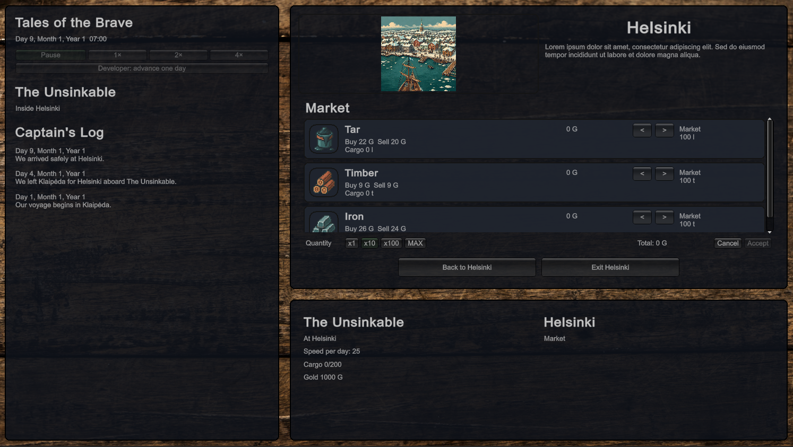
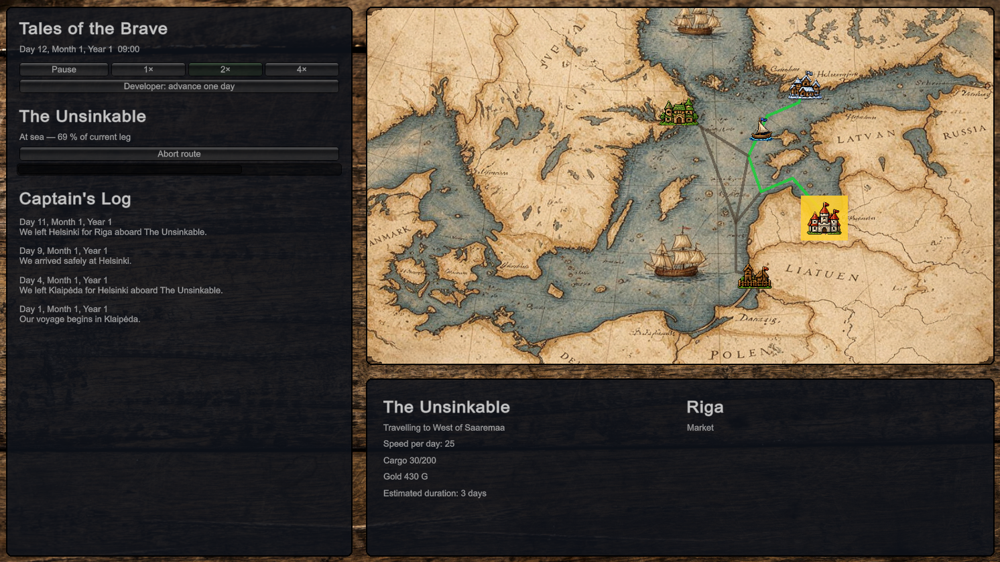

# Tales of the Brave

The little simulator that could. For now only naval Baltic trade though.

## Current version - approaching 0.3

Features breakdown:
* 0.1 - ✅ - we like to move it, move it
* 0.2 - ✅ - dynamic economy 101
* 0.3 - ⏳ - repairs & resupplies
* 0.4 - ❌ - events eventuating
* 0.5 - ❌ - information propagation station
* 0.6 - ❌ - saving & loading & exporting & importing
* 0.7 - ❌ - questing feast
* 0.8 - ❌ - upgrading upgrade
* 0.9 - ❌ - narrative makeover takeover
* 1.0 - ❌ - public launch!

Latest build at [Tales of the Brave](https://gamingdark.github.io/games/tales-of-the-brave/)

## Some screenshots

